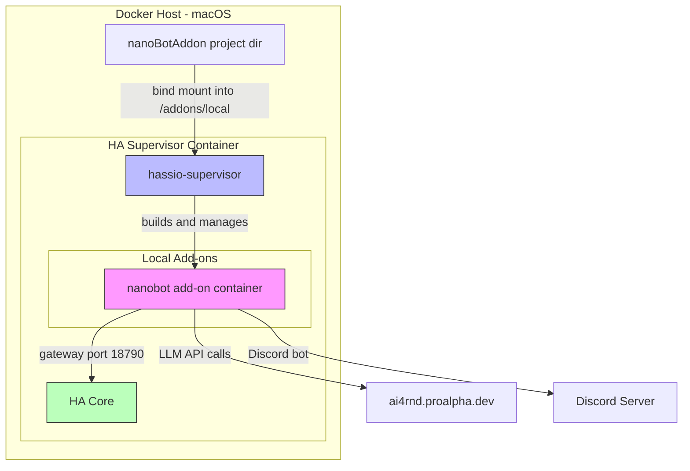
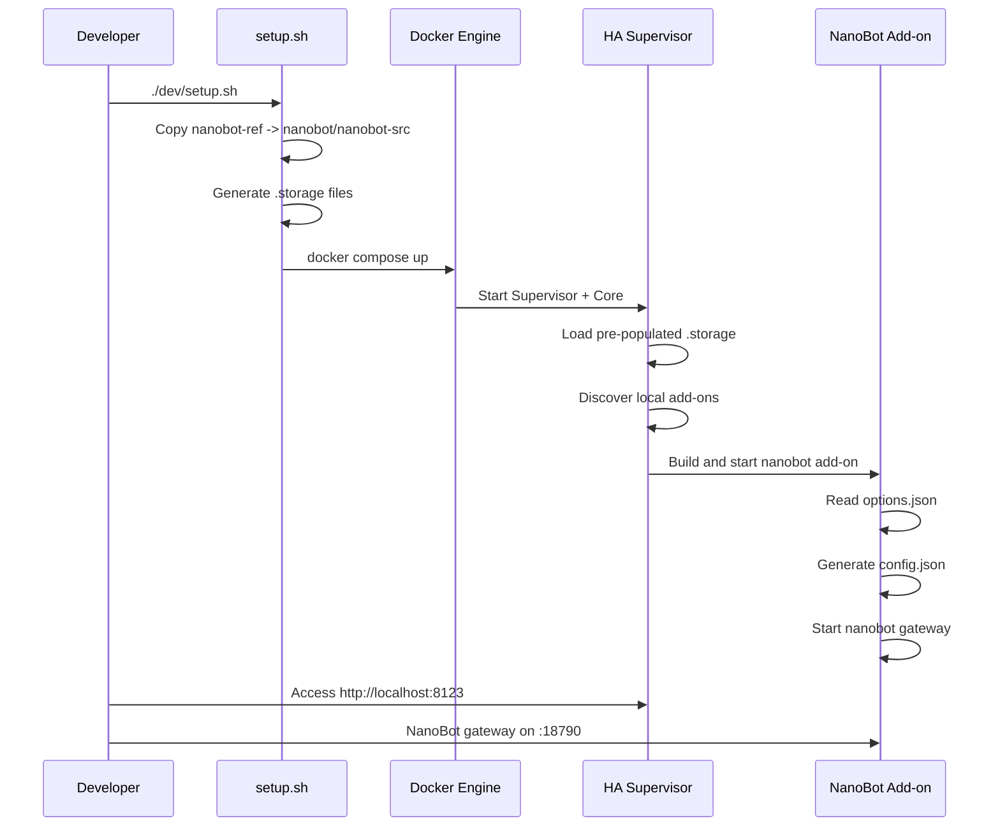

# NanoBot Home Assistant Add-on — Architecture & Implementation Plan

## Workspace Mount Strategy

NanoBot's workspace (where the AI reads/writes markdown files) is mounted at `/config/nanobot/` — the same `/config` directory that HA's built-in **File Editor** and **Studio Code Server** add-on expose to users.

### Path layout inside the container

```
/config/nanobot/
├── config.json        ← generated by generate_config.py on startup
└── workspace/         ← AI markdown files (tasks, notes, memory)
```

### Dev mode (Docker Compose)

```
Host: dev/nanobot-workspace/  ←→  Container: /config/nanobot/
```

Edit files in `dev/nanobot-workspace/` in VS Code and they are immediately visible to the running container.

### Real Home Assistant

The `config` map entry in `nanobot/config.yaml` grants the add-on read/write access to `/config`. Files appear under `/config/nanobot/` and are accessible via:
- **File Editor** add-on (built-in)
- **Studio Code Server** add-on
- **Samba** / **SSH** add-ons

---


## Overview

This plan covers:
1. **Building a Home Assistant add-on** that wraps the [NanoBot](https://github.com/HKUDS/nanobot) AI assistant
2. **Setting up a local HA Supervisor dev environment** via Docker for debugging
3. **Pre-populating `.storage`** so the add-on is immediately available without manual onboarding
4. **Configuring NanoBot** with the provided LLM API key and Discord credentials

---

## Architecture



---

## Project Structure

```
nanoBotAddon/
├── plans/
│   └── plan.md                    # This file
├── nanobot-ref/                   # Git-ignored reference checkout of HKUDS/nanobot
├── nanobot/                       # The HA add-on folder
│   ├── config.yaml                # HA add-on manifest
│   ├── Dockerfile                 # Add-on Dockerfile
│   ├── build.yaml                 # Multi-arch build config
│   ├── run.sh                     # Entrypoint: reads HA options, writes nanobot config, starts gateway
│   ├── DOCS.md                    # Add-on documentation
│   ├── README.md                  # Add-on readme
│   ├── CHANGELOG.md               # Changelog
│   ├── icon.png                   # Add-on icon
│   ├── logo.png                   # Add-on logo
│   └── translations/
│       └── en.yaml                # English option descriptions
├── repository.yaml                # HA add-on repository manifest
├── .devcontainer/
│   └── devcontainer.json          # VS Code devcontainer for HA add-on dev
├── .vscode/
│   └── tasks.json                 # VS Code tasks for HA dev
├── dev/
│   ├── docker-compose.yml         # Docker Compose for local HA Supervisor
│   ├── setup.sh                   # Bootstrap script for dev environment
│   └── .storage/                  # Pre-populated Supervisor storage
│       ├── core.config_entries     # Empty HA config entries
│       ├── core.entity_registry   # Empty entity registry
│       ├── core.device_registry   # Empty device registry
│       ├── core.area_registry     # Empty area registry
│       ├── auth                   # Pre-created admin user
│       ├── auth_provider.homeassistant  # Hashed password for dev user
│       └── onboarding             # Mark onboarding as complete
├── .gitignore
└── README.md                      # Project-level readme
```

---

## Detailed Steps

### 1. `.gitignore`

Exclude `nanobot-ref/` and standard Docker/Python artifacts.

### 2. HA Add-on `config.yaml`

Key configuration:

| Field | Value |
|-------|-------|
| `name` | NanoBot AI Assistant |
| `version` | 0.1.4 |
| `slug` | nanobot |
| `description` | Ultra-lightweight personal AI assistant |
| `arch` | amd64, aarch64 |
| `startup` | application |
| `boot` | auto |
| `ports` | 18790/tcp: 18790 |
| `map` | data read/write, ssl read-only |

**Options schema** — exposed in the HA UI:

```yaml
options:
  llm_provider: "custom"
  llm_api_key: ""
  llm_base_url: ""
  llm_model: "claude-4.5"
  discord_enabled: false
  discord_bot_token: ""
  discord_channel_id: ""
  log_level: "info"
schema:
  llm_provider: str
  llm_api_key: password
  llm_base_url: url
  llm_model: str
  discord_enabled: bool
  discord_bot_token: password
  discord_channel_id: str
  log_level: list(trace|debug|info|warning|error)
```

### 3. Add-on `Dockerfile`

Strategy: Use the HA base image `ghcr.io/home-assistant/{arch}-base:latest` as `BUILD_FROM`, then install Python 3.12, Node.js 20, and nanobot from the bundled source.

```dockerfile
ARG BUILD_FROM
FROM $BUILD_FROM

# Install Python 3.12, Node.js 20, and build deps
RUN apk add --no-cache \
    python3 py3-pip python3-dev \
    nodejs npm \
    git curl ca-certificates \
    gcc musl-dev libffi-dev openssl-dev

# Copy nanobot source
COPY nanobot-src/ /app/

WORKDIR /app

# Install nanobot with discord extra
RUN pip3 install --no-cache-dir -e ".[discord]"

# Build WhatsApp bridge - optional
WORKDIR /app/bridge
RUN npm install && npm run build || true
WORKDIR /app

# Copy run script
COPY run.sh /
RUN chmod a+x /run.sh

CMD ["/run.sh"]
```

> **Note:** The Dockerfile copies the nanobot source from a `nanobot-src/` directory inside the add-on build context. The `run.sh` or a build step will copy from `nanobot-ref/` into `nanobot/nanobot-src/` before building.

### 4. `run.sh` Entrypoint

The script:
1. Reads `/data/options.json` using `bashio` or `jq`
2. Generates `~/.nanobot/config.json` from the HA options
3. Starts `nanobot gateway`

```bash
#!/usr/bin/with-bashio
# Read options
LLM_PROVIDER=$(bashio::config 'llm_provider')
LLM_API_KEY=$(bashio::config 'llm_api_key')
LLM_BASE_URL=$(bashio::config 'llm_base_url')
LLM_MODEL=$(bashio::config 'llm_model')
DISCORD_ENABLED=$(bashio::config 'discord_enabled')
DISCORD_TOKEN=$(bashio::config 'discord_bot_token')
DISCORD_CHANNEL=$(bashio::config 'discord_channel_id')

# Build config.json
python3 /app/generate_config.py \
  --provider "$LLM_PROVIDER" \
  --api-key "$LLM_API_KEY" \
  --base-url "$LLM_BASE_URL" \
  --model "$LLM_MODEL" \
  --discord-enabled "$DISCORD_ENABLED" \
  --discord-token "$DISCORD_TOKEN" \
  --discord-channel "$DISCORD_CHANNEL"

# Start nanobot gateway
exec nanobot gateway
```

A small Python helper `generate_config.py` will construct the proper JSON config matching the nanobot schema.

### 5. `build.yaml`

```yaml
build_from:
  amd64: ghcr.io/home-assistant/amd64-base:latest
  aarch64: ghcr.io/home-assistant/aarch64-base:latest
args:
  BUILD_VERSION: "0.1.4"
```

### 6. Pre-populated `.storage` for Dev

The `.storage` folder needs these files to skip HA onboarding:

| File | Purpose |
|------|---------|
| `auth` | Auth store with a pre-created admin user |
| `auth_provider.homeassistant` | Hashed password for the dev user |
| `onboarding` | Marks onboarding steps as done |
| `core.config_entries` | Empty config entries |
| `core.entity_registry` | Empty entity registry |
| `core.device_registry` | Empty device registry |
| `core.area_registry` | Empty area registry |

Default dev credentials: `admin` / `admin` — the password hash will be generated using `bcrypt`.

### 7. Docker Compose for Dev

Uses the HA devcontainer image with the add-on mounted as a local add-on:

```yaml
services:
  hassio:
    image: ghcr.io/home-assistant/devcontainer:2-apps
    privileged: true
    ports:
      - "8123:8123"
      - "18790:18790"
    volumes:
      - hassio-data:/mnt/supervisor
      - /var/run/docker.sock:/run/docker.sock
      - ../nanobot:/mnt/supervisor/addons/local/nanobot
      - ./storage:/config/.storage
    environment:
      - WORKSPACE_DIRECTORY=/mnt/supervisor/addons/local/nanobot

volumes:
  hassio-data:
```

### 8. Setup Script `dev/setup.sh`

The script will:
1. Check Docker is running
2. Copy nanobot source from `nanobot-ref/` into `nanobot/nanobot-src/`
3. Generate the `.storage` files with pre-created admin user
4. Start docker-compose
5. Wait for HA to be ready
6. Print access URL

### 9. NanoBot Config Mapping

The HA options map to nanobot's `config.json` as follows:

| HA Option | NanoBot Config Path |
|-----------|-------------------|
| `llm_provider` | `agents.defaults.provider` |
| `llm_api_key` | `providers.custom.apiKey` |
| `llm_base_url` | `providers.custom.apiBase` |
| `llm_model` | `agents.defaults.model` |
| `discord_enabled` | `channels.discord.enabled` |
| `discord_bot_token` | `channels.discord.token` |
| `discord_channel_id` | Used for allow_from or initial channel targeting |

For the provided credentials, the generated config.json will look like:

```json
{
  "agents": {
    "defaults": {
      "model": "claude-4.5",
      "provider": "custom"
    }
  },
  "providers": {
    "custom": {
      "apiKey": "<YOUR_API_KEY>",
      "apiBase": "https://your-llm-provider.example.com/v1"
    }
  },
  "channels": {
    "discord": {
      "enabled": true,
      "token": "<YOUR_DISCORD_BOT_TOKEN>"
    }
  },
  "gateway": {
    "host": "0.0.0.0",
    "port": 18790
  }
}
```

---

## Dev Workflow



---

## Security Notes

- API keys and tokens are stored in HA's encrypted options store
- The `llm_api_key` and `discord_bot_token` fields use the `password` schema type so they are masked in the UI
- The dev `.storage` files use a known password — **never use in production**

---

## Files to Create

1. `.gitignore` — exclude `nanobot-ref/`, `__pycache__`, `.storage` generated files
2. `repository.yaml` — HA add-on repository manifest
3. `nanobot/config.yaml` — HA add-on configuration
4. `nanobot/Dockerfile` — Add-on container image
5. `nanobot/build.yaml` — Build configuration
6. `nanobot/run.sh` — Entrypoint script
7. `nanobot/generate_config.py` — Config generator helper
8. `nanobot/translations/en.yaml` — English translations
9. `nanobot/DOCS.md` — Documentation
10. `nanobot/README.md` — Add-on readme
11. `nanobot/CHANGELOG.md` — Changelog
12. `dev/docker-compose.yml` — Dev environment compose
13. `dev/setup.sh` — Dev bootstrap script
14. `dev/.storage/` — Pre-populated storage files
15. `.devcontainer/devcontainer.json` — VS Code devcontainer
16. `.vscode/tasks.json` — VS Code tasks
17. `README.md` — Project readme
